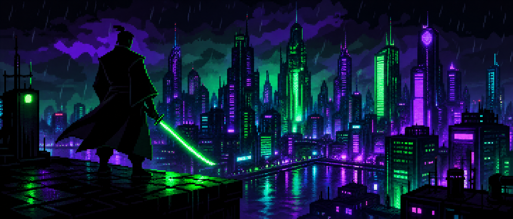

  

<h1 align="center">
  <a href="https://github.com/MGorkemMeric">
    
    Görkem | <i>Game Developer & Code Alchemist</i>
    
  </a>
</h1>

  
  &nbsp;&nbsp;
  
  &nbsp;&nbsp;
  

  <i><b>"First, solve the problem. Then, write the code."</b></i>

---

## &#x1F525; GitHub Stats

| **Commits** | **Pull Requests** | **Issues** | **Repositories** |
|:-----------:|:-----------------:|:----------:|:----------------:|
|  |  |  |  |

---

## &#x1F3AE; Featured Projects

| Project | Description | Tech Stack |
|:-------:|:-----------:|:----------:|
| **CircleClash** | Fast-paced circle battle game with strategic gameplay | C# / Unity |
| **TopDownArena** | Top-down arena shooter with waves of enemies | C# / ShaderLab |
| **CTRL7** | Barcode tracking & inventory management system | TypeScript |
| **FindBound** | Logic puzzle game - find the hidden boundaries | TypeScript / ShaderLab |

---

## &#x1F6E0;&#xFE0F; Tech Stack & Skills

  <!-- Languages -->
  
  
  
  

  <!-- Tools -->
    
  
  
  
  

---

## &#x26A1; GitHub Contribution Snake

  

---

## &#x1F517; Connect With Me

  
  &nbsp;&nbsp;
  

---

  

